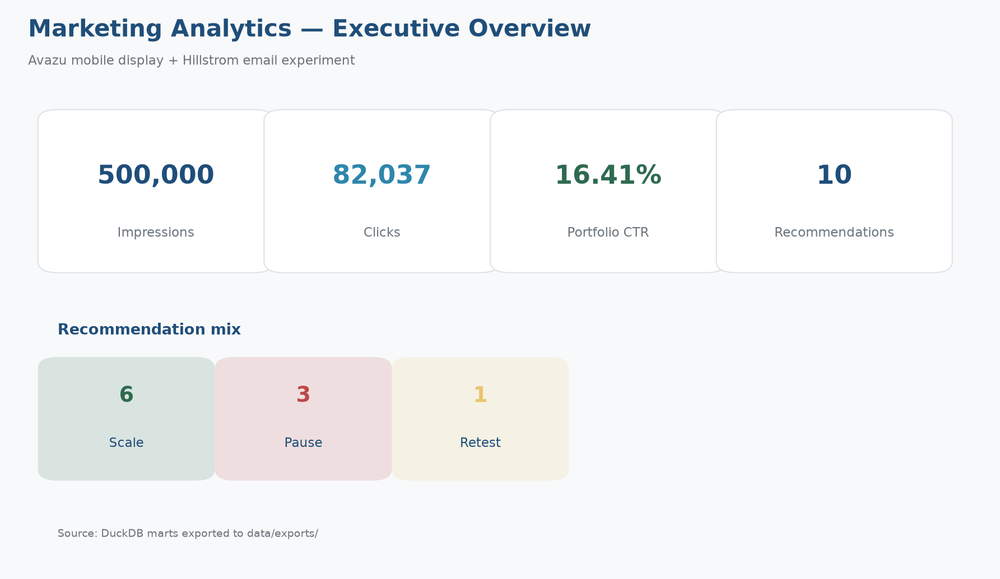
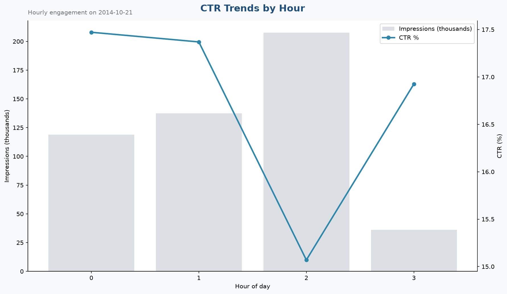
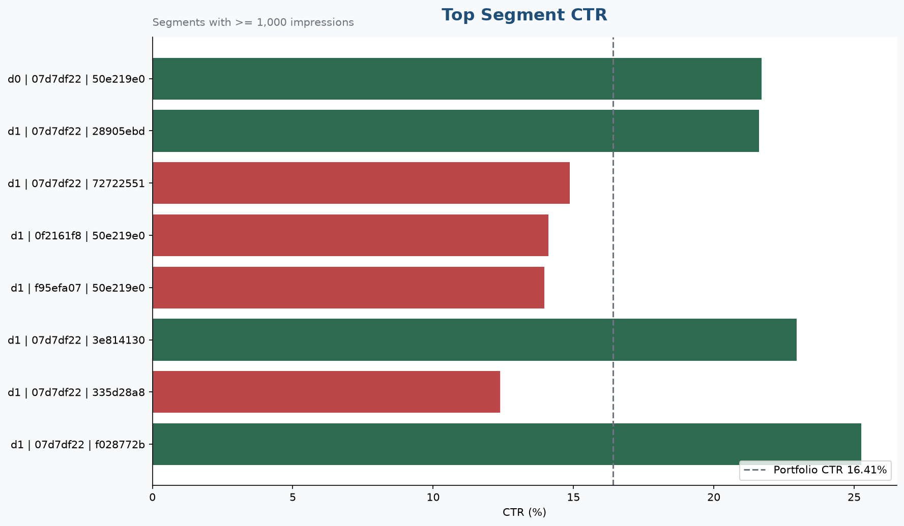
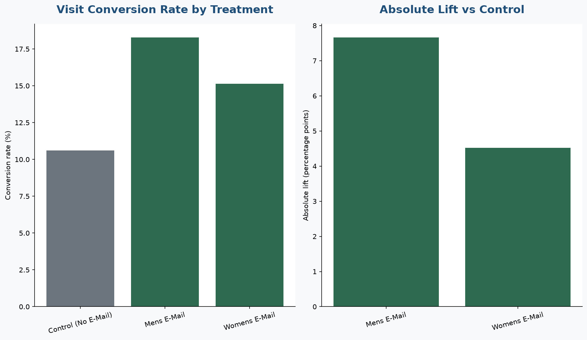
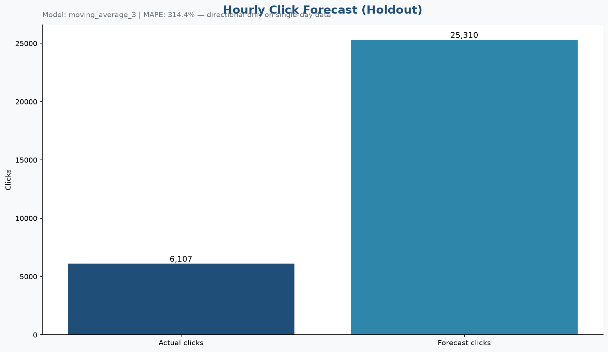
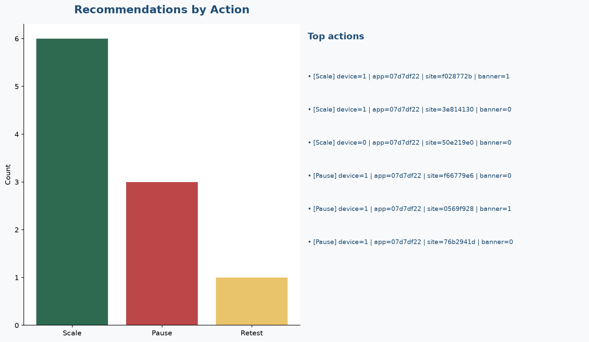

# Cloud Marketing Experimentation & Forecasting Analytics

> **Which mobile ad segments drive engagement, does email treatment create statistically significant lift, and what should marketing scale, pause, or retest?**

A cloud marketing analytics project using **AWS S3**, **DuckDB**, **SQL**, **Python**, **Tableau**, and **Excel** to analyze real mobile ad click data and email A/B test performance.

---

## Project Overview

This project analyzes two real marketing datasets:

| Dataset | Use Case |
|---------|----------|
| **Avazu mobile ad click data** | CTR trends, campaign performance, device/app segmentation, forecasting |
| **Hillstrom email experiment data** | A/B test lift, conversion significance, revenue impact, retest recommendations |

The workflow moves from raw data profiling and cleaning through SQL analytical marts to stakeholder-ready Tableau dashboards and an Excel executive workbook.

---

## Business Questions

1. **Segment performance** — Which device, app, site, and time-of-day segments drive the highest CTR?
2. **Experiment lift** — Does email treatment produce statistically significant conversion and revenue lift over control?
3. **Forecasting** — What do near-term click and CTR trends suggest for campaign planning?
4. **Action** — What should marketing **scale**, **pause**, or **retest**?

---

## Architecture

```
Real datasets (Avazu + Hillstrom)
        ↓
Local Python profiling + cleaning
        ↓
AWS S3 (raw / processed / marts / exports)
        ↓
DuckDB (raw → staging → mart tables)
        ↓
CSV exports
        ↓
Tableau dashboard + Excel stakeholder workbook
```

---

## Tech Stack

| Layer | Tools |
|-------|-------|
| **Languages** | Python, SQL |
| **Analytics DB** | DuckDB |
| **Cloud storage** | AWS S3, IAM, AWS Budget alerts |
| **BI** | Tableau |
| **Stakeholder reporting** | Excel (pivot tables, A/B calculator, scenario analysis) |
| **Testing** | pytest |
| **Version control** | Git / GitHub |

---

## Repository Structure

```
cloud-marketing-experimentation-analytics/
├── data/
│   ├── raw/              # Source CSV files (not committed)
│   ├── processed/        # Cleaned Parquet + DuckDB (not committed)
│   ├── marts/            # Mart CSV exports for BI tools
│   └── exports/          # Final dashboard/workbook inputs
├── scripts/              # Python pipelines
├── sql/                  # DuckDB schema and mart SQL
├── tableau/
│   └── screenshots/      # Dashboard screenshots for README
├── excel/
│   └── screenshots/      # Workbook screenshots for README
├── docs/                 # Business context, metrics, methodology
├── tests/                # Data contract and pipeline tests
├── README.md
├── requirements.txt
├── .env.example
└── .gitignore
```

---

## Datasets

### Avazu Mobile Ad Click Data
Real mobile advertising click/no-click data. Used for CTR analysis, segment performance, hourly/daily engagement trends, and click forecasting.

### Hillstrom Email Marketing Experiment
Real email campaign experiment with treatment and control groups. Used for A/B test analysis, lift measurement, confidence intervals, and retest recommendations.

> All analysis uses real data only. No synthetic experiment layers.

---

## Key Metrics

| Metric | Definition |
|--------|------------|
| **Impressions** | Ad exposures or email sends |
| **Clicks** | Click events (Avazu) |
| **CTR** | Clicks ÷ Impressions |
| **Conversion Rate** | Conversions ÷ Recipients (Hillstrom) |
| **Revenue per Customer** | Total revenue ÷ Customers |
| **Lift** | Treatment metric − Control metric |
| **p-value** | Statistical significance of treatment effect |
| **MAPE** | Forecast accuracy (Mean Absolute Percentage Error) |

See [docs/metric_definitions.md](docs/metric_definitions.md) for full definitions.

---

## Documentation

| Doc | Description |
|-----|-------------|
| [business_problem.md](docs/business_problem.md) | Stakeholder context and decision framework |
| [metric_definitions.md](docs/metric_definitions.md) | KPI definitions and formulas |
| [data_dictionary.md](docs/data_dictionary.md) | Source and mart column reference |
| [project_plan.md](docs/project_plan.md) | Build plan and deliverables |
| [cost_controls.md](docs/cost_controls.md) | AWS cost-safety rules |
| [aws_s3_setup.md](docs/aws_s3_setup.md) | S3 bucket, IAM, and upload setup |
| [duckdb_setup.md](docs/duckdb_setup.md) | Local DuckDB schema and warehouse setup |
| [week1_data_lock.md](docs/week1_data_lock.md) | Locked Week 1 dataset stats and pipeline contract |
| [week2_analytics_lock.md](docs/week2_analytics_lock.md) | Locked Week 2 mart stats, exports, and validation |
| [tableau_dashboard_guide.md](docs/tableau_dashboard_guide.md) | Tableau Desktop build guide (6 dashboard pages) |

---

## DuckDB Warehouse Setup

After configuring `.env` (`DUCKDB_PATH`):

```bash
python scripts/create_duckdb_database.py
```

Optional verification:

```bash
python -c "import duckdb; con=duckdb.connect('data/processed/marketing_analytics.duckdb', read_only=True); print(con.execute('SHOW TABLES').fetchdf()); con.close()"
```

See [docs/duckdb_setup.md](docs/duckdb_setup.md) for schema layers and next steps.

---

## DuckDB Load + Validation

After the warehouse schema exists and local raw/processed files are available:

```bash
python scripts/load_to_duckdb.py
python scripts/validate_data.py
```

This loads:

- `data/raw/*.csv` → `raw_avazu_ads`, `raw_hillstrom_email`
- `data/processed/*.parquet` → `stg_ad_events`, `stg_email_experiment`

Mart tables are populated by the Week 2 analytics scripts (see [week2_analytics_lock.md](docs/week2_analytics_lock.md)).

Summaries written locally (gitignored):

- `data/processed/duckdb_load_summary.json`
- `data/processed/data_validation_summary.json`

---

## Week 2 Analytics Lock

After the full Week 2 pipeline and validation pass locally:

```bash
python scripts/generate_week2_analytics_lock.py
```

This writes [docs/week2_analytics_lock.md](docs/week2_analytics_lock.md) with frozen mart statistics, A/B outcomes, forecast metrics, export inventory, and validation checkpoints.

---

## Week 1 Data Lock

After the full Week 1 pipeline and validation pass locally:

```bash
python scripts/generate_week1_data_lock.py
```

This writes [docs/week1_data_lock.md](docs/week1_data_lock.md) with frozen dataset statistics, load status, and validation checkpoints.

Run the full Week 1 test suite:

```bash
pytest -q -m "not network and not slow"
```

Targeted marker runs:

```bash
pytest -q -m docs
pytest -q -m hygiene
pytest -q -m cleaning
pytest -q -m profiling
pytest -q -m smoke
pytest -q -m duckdb
pytest -q -m s3
pytest -q -m security
pytest -q -m week1
pytest -q -m week2
```

Real-data tests (`data`, `slow`) skip automatically when local files are absent.
AWS integration tests (`aws`, `network`) are excluded by default.

---

## AWS S3 Upload

After configuring `.env` and AWS CLI (`marketing-analytics` profile):

```bash
python scripts/upload_to_s3.py
```

Verify objects in the bucket:

```bash
aws s3 ls s3://$S3_BUCKET/ --recursive --profile marketing-analytics
```

See [docs/aws_s3_setup.md](docs/aws_s3_setup.md) for full setup instructions.

---

## Getting Started

### 1. Clone and set up environment

```bash
cd cloud-marketing-experimentation-analytics
python -m venv .venv
source .venv/bin/activate   # Windows: .venv\Scripts\activate
pip install -r requirements.txt
```

### 2. Configure environment

```bash
cp .env.example .env
# Edit .env with your AWS bucket name and region
```

### 3. Run pipelines (as they are built)

```bash
# Week 1 — data foundation
python scripts/download_or_import_data.py
python scripts/profile_raw_data.py
python scripts/clean_avazu_ads.py
python scripts/clean_hillstrom_email.py
python scripts/upload_to_s3.py
python scripts/create_duckdb_database.py
python scripts/load_to_duckdb.py
python scripts/validate_data.py
# Week 2 — analytics + exports
python scripts/run_campaign_kpis.py
python scripts/run_funnel_segment_analysis.py
python scripts/run_ab_test_analysis.py
python scripts/run_ctr_forecast.py
python scripts/generate_recommendations.py
python scripts/export_dashboard_data.py
python scripts/validate_data.py
python scripts/generate_week2_analytics_lock.py

# Phase 3 — Tableau dashboard
python scripts/build_tableau_dashboard.py

# Tests
pytest -q
```

---

## Tableau Dashboard

Tableau dashboard screenshots built from DuckDB mart CSV exports (`data/exports/`). **The tracked portfolio artifact is the PNG screenshot set** in `tableau/screenshots/`. The Tableau packaged workbook (`.twbx`) is local/gitignored and not required to reproduce the code pipeline.

Regenerate screenshots after export changes:

```bash
python scripts/export_dashboard_data.py
python scripts/build_tableau_dashboard.py
```

Optional: rebuild a workbook manually in Tableau Desktop from the same CSV exports — see [docs/tableau_dashboard_guide.md](docs/tableau_dashboard_guide.md). A local `.twbx` is not committed to the repository.

---

## Dashboard Screenshots

### 1. Executive overview

500K impressions, 82,037 clicks, 16.41% CTR, and 10 recommendations (6 scale, 3 pause, 1 retest).



### 2. CTR trends

Hourly engagement snapshot from exported DuckDB mart data (single-day Avazu sample).



### 3. Segment performance

Top segments with portfolio CTR reference line (16.41%); highest segment reaches 25.25% CTR.



### 4. A/B test results

Mens and Womens email treatments outperform control with statistically significant lift (+7.66 pp and +4.52 pp absolute).



### 5. Forecast

Directional holdout forecast; MAPE is high (314.4%) because the Avazu sample is single-day/hourly — use for planning signals, not deployment-grade forecasting.



### 6. Recommendations

Scale / pause / retest summary with top action items across mobile display and email channels.



---

## Key Findings (Case Study)

Five findings from the locked analytics pipeline, illustrated in the dashboard screenshots above:

1. **Portfolio reach** — 500,000 mobile ad impressions generated 82,037 clicks at **16.41% CTR** on the Avazu single-day sample.
2. **Segment concentration** — The top device/app/site segment delivered **25.25% CTR** on 68,033 impressions (~21% of clicks), a clear scale candidate.
3. **Mens email lift** — Mens E-Mail drove **+7.66 percentage points** absolute visit lift over control (p ≈ 0, ~$16,403 incremental revenue).
4. **Womens email lift** — Womens E-Mail drove **+4.52 percentage points** absolute lift (p ≈ 0, ~$9,077 incremental revenue).
5. **Forecast caveat** — The moving-average holdout forecast shows **314.4% MAPE** on single-day hourly data; treat forecasts as directional and retest with more dates before budget decisions.

---

## Project Status

| Phase | Status |
|-------|--------|
| Repo scaffold + business framing | ✅ Complete |
| Dataset acquisition + profiling | ✅ Complete |
| Cleaning pipeline | ✅ Complete |
| AWS S3 setup + upload | ✅ Complete |
| DuckDB warehouse setup | ✅ Complete |
| DuckDB load + validation | ✅ Complete |
| Week 1 tests + docs lock | ✅ Complete |
| Campaign KPI marts | ✅ Complete |
| Funnel + segment analysis | ✅ Complete |
| A/B test analysis | ✅ Complete |
| CTR forecasting | ✅ Complete |
| Recommendations + executive summary | ✅ Complete |
| Mart exports for Tableau / Excel | ✅ Complete |
| Week 2 analytics + exports | ✅ Complete |
| Tableau dashboard (screenshots) | ✅ Complete |
| Excel stakeholder workbook | 🔲 Pending |
| Final README case study | ✅ Complete |

---

## Expected Deliverables

- AWS S3 bucket with raw / processed / marts / exports zones
- DuckDB analytical database with staging and mart tables
- Python cleaning, profiling, and export scripts
- SQL marts for campaign KPIs, A/B tests, and forecasts
- Tableau dashboard screenshots (6 PNG pages in `tableau/screenshots/`)
- Excel executive workbook with A/B calculator
- Recommendations and executive summary docs
- pytest test suite

---

## License

Portfolio / educational project.
